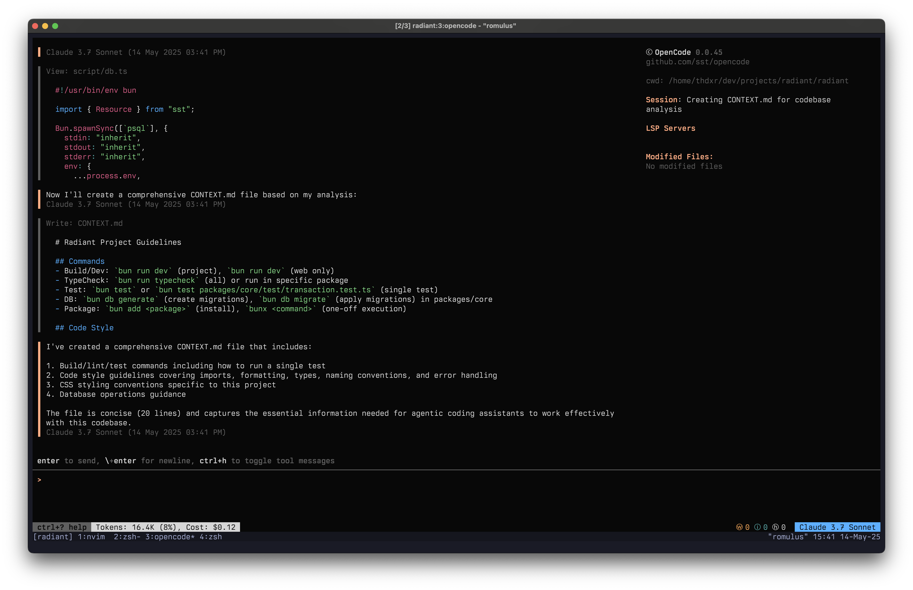

<p align="center">
  <a href="https://opencode.ai">
    <picture>
      <source srcset="packages/web/src/assets/logo-dark.svg" media="(prefers-color-scheme: dark)">
      <source srcset="packages/web/src/assets/logo-light.svg" media="(prefers-color-scheme: light)">
      
    </picture>
  </a>
</p>
<p align="center">
  <a href="https://www.npmjs.com/package/opencode-ai"></a>
  <a href="https://github.com/sst/opencode/actions/workflows/publish.yml"></a>
</p>

---

AI coding agent, built for the terminal.

**Note:** Version 0.1.x is a full rewrite, and we do not have proper documentation for it yet. Should have this out week of June 17th 2025.

[](https://opencode.ai)

### Installation

```bash
# YOLO
curl -fsSL https://opencode.ai/install | bash

# Package managers
npm i -g opencode-ai@latest        # or bun/pnpm/yarn
brew install sst/tap/opencode      # macOS
paru -S opencode-bin               # Arch Linux
```

> **Note:** Remove versions older than 0.1.x before installing

### Providers

The recommended approach is to sign up for Claude Pro or Max, run `opencode auth login`, and select Anthropic. It's the most cost-effective way to use opencode.

opencode is powered by the provider list at [Models.dev](https://models.dev), so you can use `opencode auth login` to configure API keys for any provider you'd like to use. This is stored in `~/.local/share/opencode/auth.json`.

```bash
$ opencode auth login

┌  Add credential
│
◆  Select provider
│  ● Anthropic (recommended)
│  ○ OpenAI
│  ○ Google
│  ○ Amazon Bedrock
│  ○ Azure
│  ○ DeepSeek
│  ○ Groq
│  ...
└
```

The Models.dev dataset is also used to detect common environment variables like `OPENAI_API_KEY` to autoload that provider.

If there are additional providers you want to use you can submit a PR to the [Models.dev repo](https://github.com/sst/models.dev). If configuring just for yourself check out the Config section below.

### Project Config

Project configuration is optional. You can place an `opencode.json` file in the root of your repo, and it'll be loaded.

```json title="opencode.json"
{
  "$schema": "http://opencode.ai/config.json"
}
```

#### MCP

```json title="opencode.json"
{
  "$schema": "http://opencode.ai/config.json",
  "mcp": {
    "localmcp": {
      "type": "local",
      "command": ["bun", "x", "my-mcp-command"],
      "environment": {
        "MY_ENV_VAR": "my_env_var_value"
      }
    },
    "remotemcp": {
      "type": "remote",
      "url": "https://my-mcp-server.com"
    }
  }
}
```

#### Providers

You can use opencode with any provider listed at [here](https://ai-sdk.dev/providers/ai-sdk-providers). Be sure to specify the npm package to use to load the provider.

```json title="opencode.json"
{
  "$schema": "https://opencode.ai/config.json",
  "provider": {
    "ollama": {
      "npm": "@ai-sdk/openai-compatible",
      "options": {
        "baseURL": "http://localhost:11434/v1"
      },
      "models": {
        "llama2": {
          "name": "llama2"
        }
      }
    }
  }
}
```

### Contributing

To run opencode locally you need.

- Bun
- Golang 1.24.x

To run.

```bash
$ bun install
$ cd packages/opencode
$ bun run src/index.ts
```

### FAQ

#### How do I use this with OpenRouter?

OpenRouter is not in the Models.dev database yet, but you can configure it manually.

```json title="opencode.json"
{
  "$schema": "https://opencode.ai/config.json",
  "provider": {
    "openrouter": {
      "npm": "@openrouter/ai-sdk-provider",
      "name": "OpenRouter",
      "options": {
        "apiKey": "sk-xxxxxxxxxxxxxxxxxxxxxxxxxxxxxxxx"
      },
      "models": {
        "anthropic/claude-3.5-sonnet": {
          "name": "Claude 3.5 Sonnet"
        }
      }
    }
  }
}
```

#### How is this different than Claude Code?

It's very similar to Claude Code in terms of capability. Here are the key differences:

- 100% open source
- Not coupled to any provider. Although Anthropic is recommended, opencode can be used with OpenAI, Google or even local models. As models evolve the gaps between them will close and pricing will drop so being provider agnostic is important.
- A focus on TUI. opencode is built by neovim users and the creators of [terminal.shop](https://terminal.shop); we are going to push the limits of what's possible in the terminal.
- A client/server architecture. This for example can allow opencode to run on your computer, while you can drive it remotely from a mobile app. Meaning that the TUI frontend is just one of the possible clients.

#### What about Windows support?

There are some minor problems blocking opencode from working on windows. We are working on on them now. You'll need to use WSL for now.

#### What's the other repo?

The other confusingly named repo has no relation to this one. You can [read the story behind it here](https://x.com/thdxr/status/1933561254481666466).

---

**Join our community** [YouTube](https://www.youtube.com/c/sst-dev) | [X.com](https://x.com/SST_dev)
