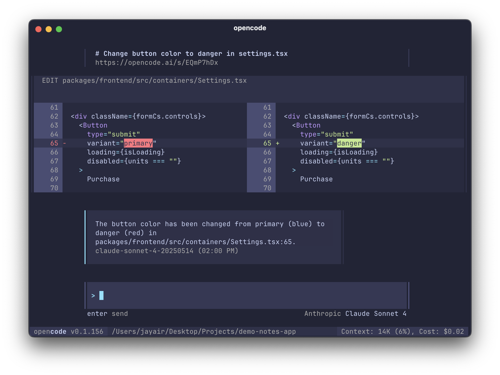

import { Tabs, TabItem } from '@astrojs/starlight/components';

[**opencode**](/) is an AI coding agent built for the terminal. It features:

- A responsive, native, themeable terminal UI.
- Automatically loads the right LSPs, so the LLMs make fewer mistakes.
- Have multiple agents working in parallel on the same project.
- Create shareable links to any session for reference or to debug.
- Log in with Anthropic to use your Claude Pro or Claude Max account.
- Supports 75+ LLM providers through [Models.dev](https://models.dev), including local models.



---

## Install

<Tabs>
  <TabItem label="npm">
  ```bash
  npm install -g opencode-ai
  ```
  </TabItem>
  <TabItem label="Bun">
  ```bash
  bun install -g opencode-ai
  ```
  </TabItem>
  <TabItem label="pnpm">
  ```bash
  pnpm install -g opencode-ai
  ```
  </TabItem>
  <TabItem label="Yarn">
  ```bash
  yarn global add opencode-ai
  ```
  </TabItem>
</Tabs>

You can also install the opencode binary through the following.

##### Using the install script

```bash
curl -fsSL https://opencode.ai/install | bash
```

##### Using Homebrew on macOS

```bash
brew install sst/tap/opencode
```

##### Using Paru on Arch Linux

```bash
paru -S opencode-bin
```

##### Windows

Right now the automatic installation methods do not work properly on Windows. However you can grab the binary from the [Releases](https://github.com/sst/opencode/releases).

---

## Providers

We recommend signing up for Claude Pro or Max, running `opencode auth login` and selecting Anthropic. It's the most cost-effective way to use opencode.

```bash
$ opencode auth login

┌  Add credential
│
◆  Select provider
│  ● Anthropic (recommended)
│  ○ OpenAI
│  ○ Google
│  ○ Amazon Bedrock
│  ○ Azure
│  ○ DeepSeek
│  ○ Groq
│  ...
└
```

opencode is powered by the provider list at [Models.dev](https://models.dev), so you can use `opencode auth login` to configure API keys for any provider you'd like to use. This is stored in `~/.local/share/opencode/auth.json`.

The Models.dev dataset is also used to detect common environment variables like `OPENAI_API_KEY` to autoload that provider.

If there are additional providers you want to use you can submit a PR to the [Models.dev repo](https://github.com/sst/models.dev). You can also [add them to your config](/docs/config) for yourself.
