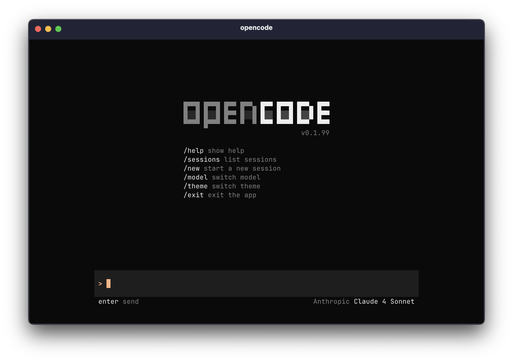
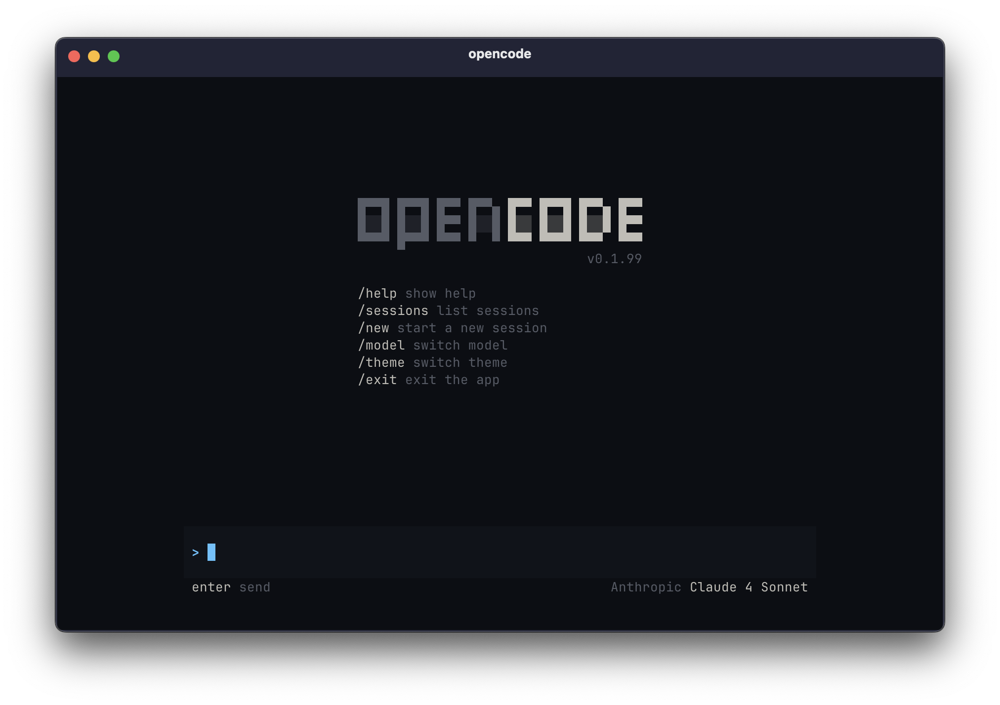
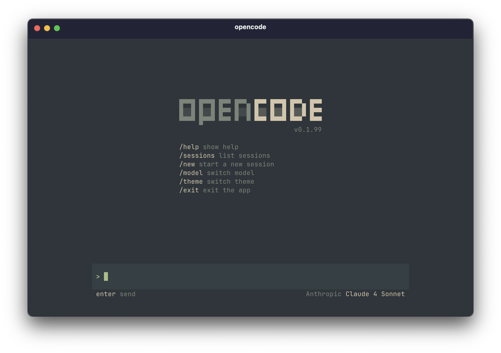

opencode will support most common terminal themes and you'll soon be able to create your own custom theme.

---

## Built-in

The following built-in themes are available:

- `opencode`

  

- `ayu`

  

- `everforest`

  

- `tokyonight`

  

---

## Configure

To select a theme, type in:

```bash frame="none"
/themes
```

Your selected theme will be used the next time you start opencode.

You can also configure it in your opencode config.

```json title="opencode.json" {3}
{
  "$schema": "https://opencode.ai/config.json",
  "theme": "tokyonight"
}
```
